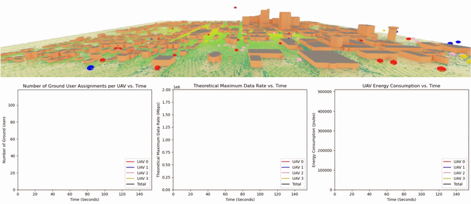

# RL-AERPAW-DT
## A UAV Digital Twin for Communication Optimization with Reinforcement Learning

## Research Poster

This research poster was presented at the Goodnight Research Symposium at NC State on March 18th, 2025.

## Case 2: Demonstration of What-if Analysis on Network Performance (Consider both system and user performance)

The GIF above shows the evolution of the coverage map (top), the Total Theoretical Maximum Data Rate across all UAV-GroundUser connections (bottom left), the UAV Assignments (bottom middle), and the power consumption of each UAV (bottom right).

## Case 1: Demonstration of What-if Analysis on Network Performance (Prioritize user QoS)

The GIF above shows the same evolution, without the load balacing optimization. From this, we can see that the Ground Users are more dispersed in their assignments, and that there is a greater overall coverage.

## Goals
- Construct a pipeline for the simulation of pedestrian data using SUMO
- Import building data from OpenStreetMaps and use Sionna for ray tracing
- Create a realistic simulation for simulating UAV communication with ground users in urban settings.
- Train a reinforcement learning model to control the UAVs to maximize the communication capacity of the UAV network with the Ground Users.

## Current Task
- Working on a minimial control framework to simulation UAV and pedestrian movement and provide a wrapper for machine learning algorithms.

## What's Done Already
- Generating pedestrian data with SUMO and parsing it into a usable format.
- Importing data from OpenStreetMaps into Sionna
- Running Sionna ray tracing algorithms to determine communication metrics like path loss between a UAV and a ground user.

