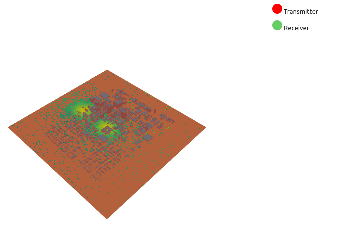
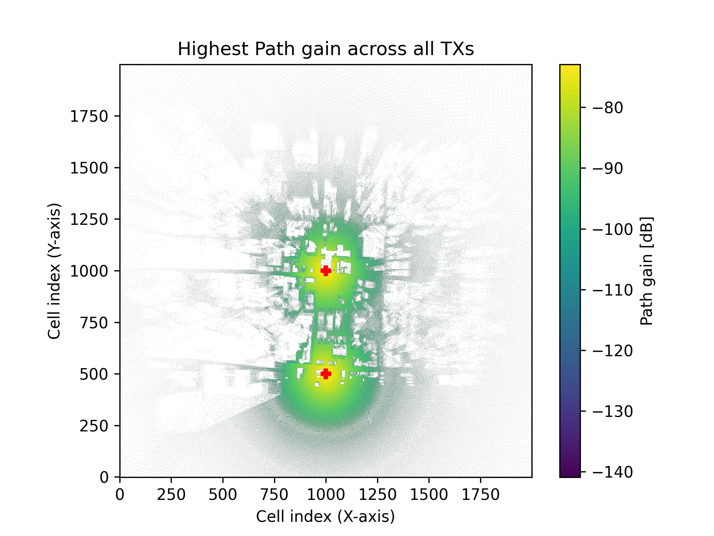
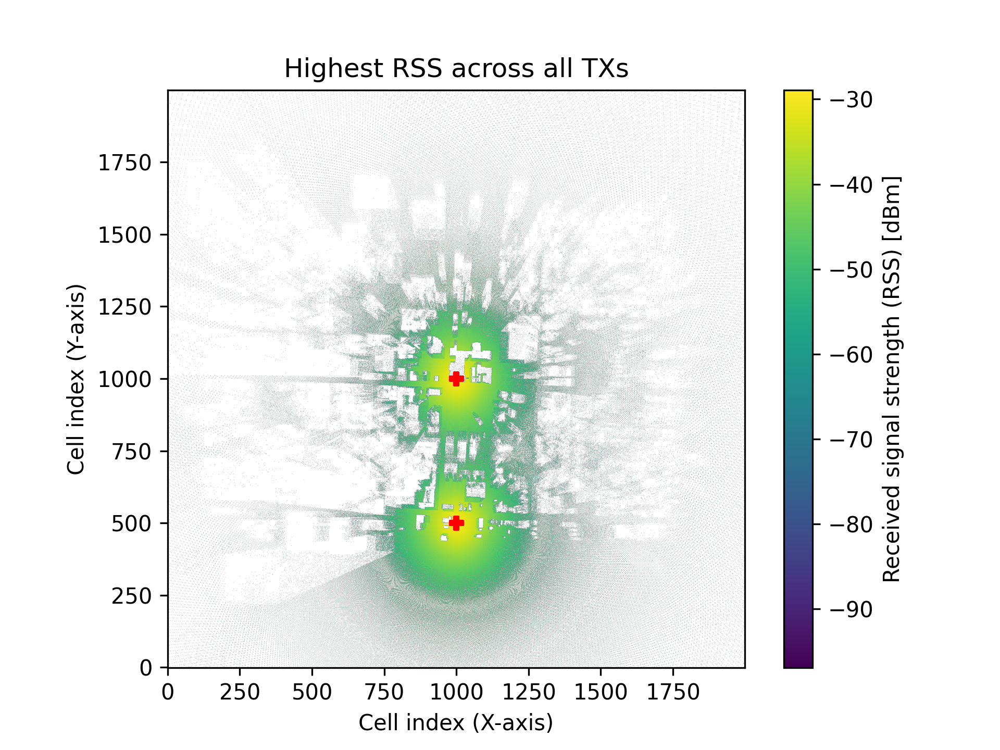
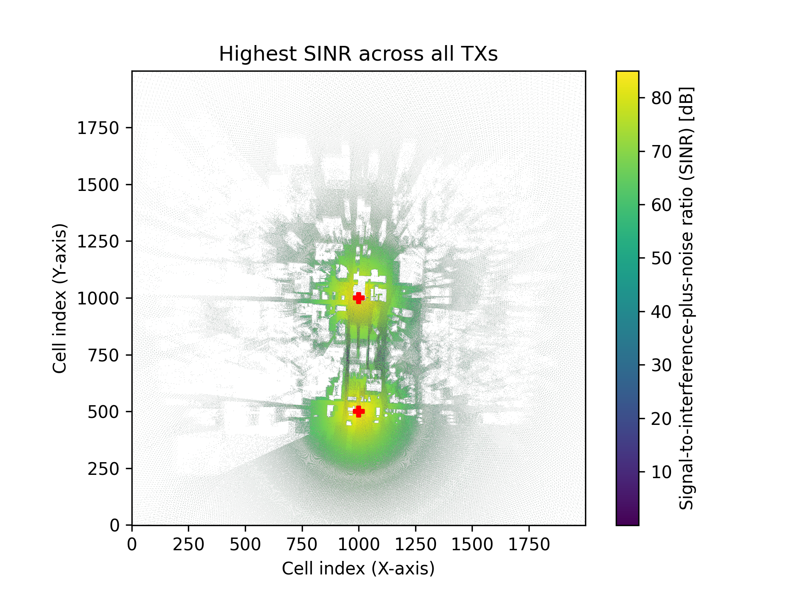

# 3D-DT
## A UAV Digital Twin for Communication Optimization and Task Planning

## Research Poster

This research poster was presented at the Goodnight Research Symposium at NC State.

## Digital Twin Demonstrations
The three GIFs below show the evolution of the digital twin environment of Raleigh City downtown area, including
* (Top) Network coverage map with Ground Users (GUs) color-coded based on their Unmanned Aerial Vehicles (UAV) assignments;
* (Far Left) The number of GUs served by each UAV;
* (Middle Left) The theoretical maximum throughput for each UAV, a measure of how optimal the UAV's position is with respect to the GUs;
* (Middle Right) The actual throughput for each UAV considering the environment and system constraints, including contributions from each assigned GU;
* (Far Right) The power consumption of each UAV including movement, hovering, and signal transmission power.

### Case 1: Demonstration of What-If Analysis on Network Performance (Prioritize Actual Data Rate)


Case 1 shows a basic throughput maximization algorithm to assign the GUs. It uses a Constraint-Programming Solver from Google OR-Tools to optimize a linear integer constraint problem. Case 1 shows that the actual data rate is high, but the number of GU assignments is incredibly variable and unstable over time, which Case 1 attempts to fix.

### Case 2: Demonstration of What-If Analysis on Network Performance (Consider GU Density and Actual Data Rate)


Case 2 showcases another bi-objective algorithm that seeks to balance the cumulative actual data rate while including a load-balancing compensation among UAVs. This algorithm attempts to maximize the minimum number of GUs connected to any UAV. Because the total number of active GUs is bounded, this results in a more equal distribution of network load. We can see from this demonstration that the total network coverage, meaning the percentage of GUs well-connected to a UAV, is almost always 100%. Furthermore, the variance in the load for each UAV is stable compared to Case 1. Finally, the acutal data rate is relatively unaffected by the network change (i.e. mobility), meaning that we gain load-balancing without losing communication performance.

### Case 3: Demonstration of What-If Analysis on Network Performance (Balance UAV Workloads and Acutal Data Rate)


Case 3 demonstrates a bi-objective algorithm that focuses on the throughput load of the UAVs to balance the users' real-time traffic demands. Importantly, the distribution of UAV loads is slightly more consistent but lower overall than the pure throughput optimization. Furthermore, the distribution of active GUs in incredibly consistent now, likely beyond what would be required of an actual simulation. This shows that taking a throughput-focused route is much more effective at balancing UAV loads than a user-count method.

## Set-Up Instructions for Building a 3D Digital Twin Network
### IMPORTANT - New Set-up Protocol for RL-DT v2.0.0
With the upgrade from Sionna v0.19.2 to Sionna v1.1.0, major changes have to be made to how the environment is instantiated, especially as it relates to CPU-only runtimes. Importantly, RL-DT is now ONLY RELIABLY SUPPORTED on LINUX. The following instructions are for CPU-ONLY operation of the library on Linux (i.e. running a computer with no CUDA-capable GPU device). For configuring Sionna with a GPU, please see the [Tensorflow GPU Set-Up](https://www.tensorflow.org/install/pip).
CPU-ONLY: Install the LLVM backend for DRJIT.
 * Update the package lists with ```sudo apt-get update && sudo apt-get upgrade```
 * Install libLLVM-19 by running ```sudo apt-get install llvm-19 llvm-19-dev clang-19```
 * Set the DRJIT_LIBLLVM_PATH environemnt variable by running ```export DRJIT_LIBLLVM_PATH=/usr/lib/llvm-19/lib/libLLVM.so```
 * Update GCC in Conda Environment by running ```conda install gcc=12.1.0``` from your desired conda environment and then ```export LD_LIBRARY_PATH=$LD_LIBRARY_PATH:$HOME/miniconda3/lib```

### Basic Initialization - Sample Data
1. To begin using the digital environment with the sample data, which includes a 118 pedestrian position time series within a building map of downtown Raleigh, simply clone the git repository to your local machine.
2. You can then use methods from the library by importing EnvironmentFramework to your Jupyter Notebook or Python files.
3. A good starting point is running the Demonstration Notebook, which includes an overview of the simulation's features that you can customize and modify to suit your needs.

### Advanced Set-Up - Custom Data Integration
1. Identify your target region by getting the minimum and maximum latitude and longitude coordinates of your bounding box and storing them in the file named bounding_box.txt. This is essential for the data parsing and synchronization of Building and Pedestrian Data.
2. Import building data as an XML file. There is a great [video tutorial](https://www.youtube.com/watch?v=7xHLDxUaQ7c) by a developer from Sionna. We highly suggest watching this tutorial before installation.
  * First, you need to download [Blender](https://www.blender.org/download/), which is an open-source 3D rendering and modeling software. We use Blender 4.2 but you could likely use a more recent version.
  * Download the [Mitsuba Blender Add-On](https://github.com/mitsuba-renderer/mitsuba-blender/releases), e.g. version 0.4.0. Just download the .zip file from their GitHub releases, then follow their installation and update guide [Link to Installation Guide](https://github.com/mitsuba-renderer/mitsuba-blender/wiki/Installation-&-Update-Guide) to include it in Blender. This is used for exporting as an XML.
  * Download [Blosm](https://prochitecture.gumroad.com/l/blender-osm), which is another Blender add-on for importing data from OpenStreetMaps. You can choose to pay for it on the website, or not. Then, follow these [installation instructions](https://github.com/vvoovv/blosm/wiki/Documentation#installation) to set it up inside Blender.
  *  In Blender, open the Blosm tab on the right of the view area. Input your coordinates from bounding_box.txt, and then specify the import options for OpenStreetMaps. This should take a few minutes to pull all the data from the OpenStreetMaps server, but when you're done it should look like this:

  * Go to File -> Export -> mitsuba (.xml), and then select your location and preferred coordinate system. We would suggest using X Forward, Z up because that's what I used in my example.
  * Move this .xml file into the data directory of your cloned repository, it should now be accessible within the simulation.
3. Generate Pedestrian Data with Simulation of Urban Mobility (SUMO).
 * Download [SUMO](https://eclipse.dev/sumo/).
 * In your SUMO installation, navigate to Eclipse -> Sumo -> tools -> osmWebWizard.py, and run it as a Python script. This should open a web browser where you can input all the parameters of your simulation in a simple format. There is also a [tutorial](https://sumo.dlr.de/docs/Tutorials/OSMWebWizard.html) on using osmWebWizard.
 * The osmWebWizard should generate a directory filled with configuration files, which can then be visualized and run with the sumo-gui. Sumo-gui is located in Eclipse -> Sumo -> bin -> sumo-gui.exe. Run this executable. This should open an application where you can go to File -> Open Simulation and select your osm.sumocfg file from the osmWebWizard export. It should look something like this:
 
 * You can modify the simulation here, or simply run it with the green button in the top left. Once you have run the simulation, go to Simulation -> Save and save the simulation results.
 * Use the xml2csv converter located in Eclipse -> Sumo -> tools -> xml -> xml2csv, to convert the outputted xml files to csvs.
 * Use the sumoSimulationDataParser within the data parsing folder of this Git repository to convert the csv files to a useable format for the simulation environment. This requires the bounding box to account for positions effectively. You can call it like so
```
python sumoSimulationDataParser.py bounding_box.txt simulation_output.csv vehicle_result.csv pedestrian_result.csv
```
 * Move the vehicle_result.csv and pedestrian_result.csv files into the data folder of your cloned repository, they should now be usable within your simulation environment. 

### Contact
If you have any questions about the simulation environment or need help with set-up, please contact Everett Tucker at eftucker@ncsu.edu

### Ongoing Work (to be updated)
- Connect a reinforcement learning pipeline to control the UAVs to maximize the communication capacity.
- Develop a minimial control framework to incoporate pedestrian movements and provide a wrapper for machine learning algorithms using the real-time data stream from the NCSU AERPAW testbed.

### Generating Radio Map Data

This section shows how to use the framework to generate radio map data (e.g., path gain, RSS, SINR) with Sionna-RT.

> **Note**: If you encounter dependency errors when installing packages (especially `MarkupSafe` / `Jinja2`), you may need to manually install compatible versions before installing the full requirements:
> ```bash
> pip install "markupsafe>=2.1.3,<3" "jinja2>=3.1,<4"
> pip install -r pip_reqs.txt
> ```
> This should allow you to successfully run the radio-map utilities.

---

#### Step-by-step example

Below is a minimal working example of how to:
1. Load a scene (`.xml`) and ground user trajectories (`.csv`)
2. Add UAV(s)
3. Configure antenna arrays
4. Compute and visualize the radio map

```python
import numpy as np
import tensorflow as tf
import drjit as dr
import matplotlib.pyplot as plt
import sionna

from EnvironmentFramework import Environment, UAV, GroundUser
from sionna.rt import PlanarArray
```

#### Initialize the environment
```python
test_radiomap_env = Environment(
    '../RL-AERPAW-DT/data/RaleighUnionSquareStandardReference/raleigh_union_square.xml',
    '../RL-AERPAW-DT/data/simulated_final_person_new.csv',
    time_step=1,
    ped_height=1.5,
    ped_rx=True,
    wind_vector=np.zeros(3)
)
```

#### Add UAVs
```python
id0 = test_radiomap_env.addUAV(pos=np.array([0, 0, 100]))

id1 = test_radiomap_env.addUAV(
    mass=10,
    efficiency=0.8,
    pos=np.array([0, -500, 100]),
    vel=np.zeros(3),
    bandwidth=50,
    rotor_area=0.5,
    signal_power=3
)
```

#### Set antenna arrays
```python
test_radiomap_env.setTransmitterArray()
test_radiomap_env.setReceiverArray()
```

#### Compute & visualize the radio map
```python
test_radio_map = test_radiomap_env.computeRadioMap(
    max_depth=2,
    num_samples=100000,
    cell_size=(1, 1)
)

# Project-specific visualization
test_radiomap_env.visualize(radio_map=test_radio_map)
```




You can also use Sionna’s built-in `.show()` API:
```python
test_radio_map.show(metric="path_gain")
```


```python
test_radio_map.show(metric="rss")
```


```python
test_radio_map.show(metric="sinr")
```


#### Store radio map data

You can access raw metrics as 3-D arrays (indexed by `[transmitter, x_idx, y_idx]`):
```python
test_sinr = test_radio_map.sinr
print(test_sinr.shape)
print(test_sinr[0][1000][900])  # Example: SINR at Tx0, cell (1000, 900)

# Similarly:
# test_radio_map.rss
# test_radio_map.path_gain
```
or more details on available metrics and API usage:
https://nvlabs.github.io/sionna/rt/api/radio_maps.html#sionna.rt.RadioMap

### Acknowledgement
- Everett Tucker, NCSU
- Yuchen Liu, NCSU
- NSF NAIRR Pilot Award

<!---
## Good Luck and Happy Simulating!

## Goals
- Construct a pipeline for the simulation of pedestrian data using SUMO
- Import building data from OpenStreetMaps and use Sionna for ray tracing
- Create a realistic simulation for simulating UAV communication with ground users in urban settings.
- Train a reinforcement learning model to control the UAVs to maximize the communication capacity of the UAV network with the Ground Users.

## Current Task
- Working on a minimial control framework to simulation UAV and pedestrian movement and provide a wrapper for machine learning algorithms using the real-time data stream from AERPAW testbed.

## What's Done Already
- Generating pedestrian data with SUMO and parsing it into a usable format.
- Importing data from OpenStreetMaps into Sionna
- Running Sionna ray tracing algorithms to determine communication metrics like path loss between a UAV and a ground user.
--->

